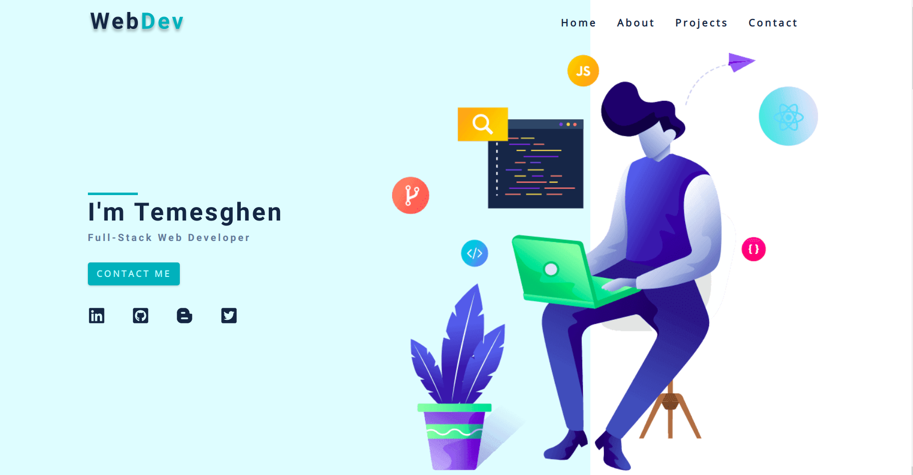

# My Portfolio

A personal portfolio app that has a list of projects I have developed and it also iterates my experience in the field of full-stack development.

<div align="center">

[](https://github.com/temesghentekeste/my-portfolio)
[](https://github.com/temesghentekeste/my-portfolio/issues)
[](https://github.com/temesghentekeste/my-portfolio/pulls)

</div>

## 📝 Content

<p align="center">
<a href="#with">Built with</a>&nbsp;&nbsp;&nbsp;|&nbsp;&nbsp;&nbsp;
<a href="#live">Live Demo</a>&nbsp;&nbsp;&nbsp;|&nbsp;&nbsp;&nbsp;
<a href="#sc">Screenshots</a>&nbsp;&nbsp;&nbsp;|&nbsp;&nbsp;&nbsp;
<a href="#gs">Getting started</a>&nbsp;&nbsp;&nbsp;|&nbsp;&nbsp;&nbsp;
<a href="#author">Author</a>
</p>

## 🔧 Built with<a name = "with"></a>

- Gatsby.js
- Strapi
- Node.js
- React
- Javascript (ES6)
- HTML5
- CSS3

## 🔴 Live Demo <a name = "live"></a>
*Click [here](https://temesghen.netlify.app/) in order to see a Live Demo of my portfolio.**


## Screenshots <a name = "sc"></a>




## Getting Started <a name = "gs"></a>


1. Install Strapi as follows:
  ```
  $ yarn create strapi-app my-project --quickstart
  ```
  - Navigate to http://localhost:1337/admin (opens new window).
  - Complete the form to create the first Administrator user.
  - Create Content Type For: 
      - job (company:text, position:text, date:text, desc:component)
      - project (title:text, description:text, image:media, desc:component_repeatable, github:text, url:text, stack:component)
  - Create Single Type For: 
      - About(title:text, info:long_text, image:media, stack:component_repeatable)
  - Fill each component with data 

  *Click [here](https://strapi.io/documentation/developer-docs/latest/getting-started/introduction.html) to visit Strapi documentation.**


2. To get a local copy of the repository please run the following commands on your terminal:
```
$ git clone git@github.com:temesghentekeste/my-portfolio.git
$ cd my-portfolio
$ gatsby develop
```

 Your site is now running at `http://localhost:8000`!


## ✒️  Author <a name = "author"></a>

👤 **Temesghen Tekeste**

- Github: [@temesghentekeste](https://github.com/temesghentekeste)
- Twitter: [@temesghentekes1](https://twitter.com/temesghentekes1)
- Linkedin: [temsghen-tekeste](https://www.linkedin.com/in/temesghentekeste/)


## 🤝 Contributing

Contributions, issues and feature requests are welcome!

Feel free to check the [issues page](https://github.com/temesghentekeste/my-portfolio/issues).


## 👍 Show your support

Give a ⭐️ if you like this project!

## :clap: Acknowledgements

- The Odin Project: [@theodinproject](https://www.theodinproject.com/)
- Stack Overflow: [@theodinproject](https://stackoverflow.com/)
- Microverse: [@microverse](https://www.microverse.org/)
